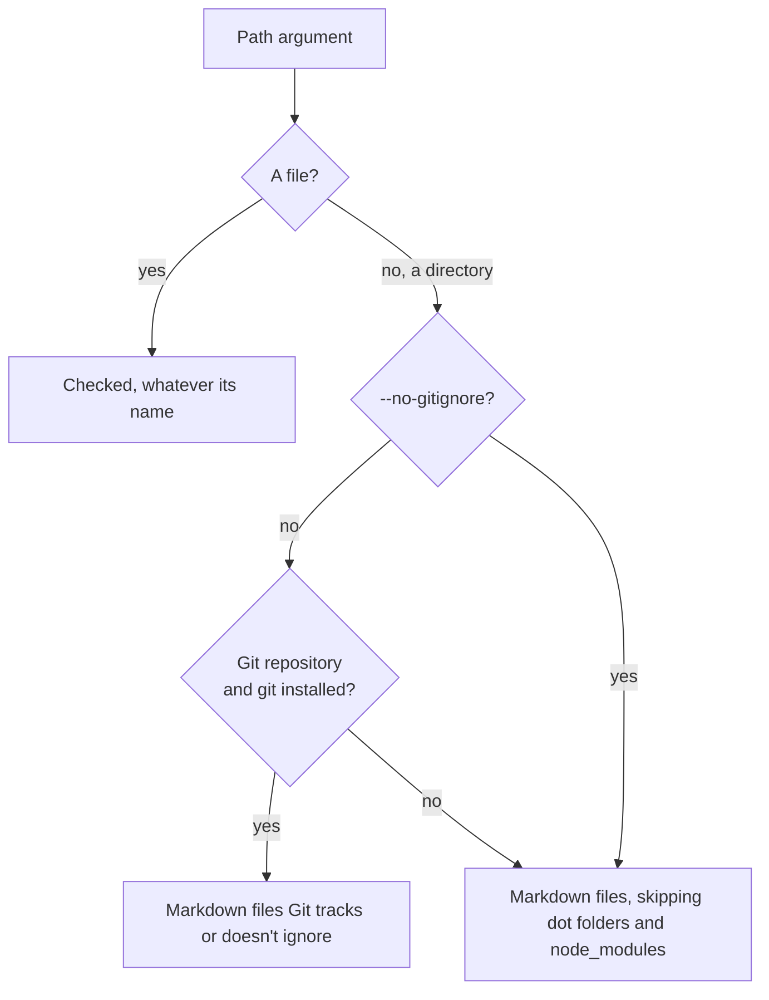

# md-links-checker

[](https://jsr.io/@simonneutert/md-links-checker)
[](https://github.com/simonneutert/md-links-checker/actions/workflows/ci.yml)

<p align="center">
  
</p>

Checks relative links in Markdown files: inline (`[text](./a.md)`), reference
definitions (`[ref]: ./a.md`) and HTML (`<a href="./a.md">`). A link fails when
its target file doesn't exist, or when its `#anchor` doesn't match a heading in
the target Markdown file (using GitHub's anchor rules, including `-1` suffixes
for repeated headings) or an HTML `id` or `name` in it, or when it is empty
(`[text]()`). Links inside fenced code blocks, inline code and HTML comments are
ignored. See [Limitations](#limitations) for what else is not covered.

**External links** are not checked: the ones with a scheme (`https:`, `mailto:`,
`jsr:`, …) or to another host (`//x.test`). `--external` lists them so you can
review them, but fetching them is out of scope: pipe the list into a tool of
your choice.

## Requirements

- [Deno](https://deno.com) 2. The only other dependency, `@std/path`, is fetched
  from JSR on the first run.
- Git is optional. Inside a Git repository, it decides which files to check and
  where links starting with `/` resolve from. Without Git, or with
  `--no-gitignore`, the checker walks directories itself.

Deno permissions:

| Flag              | Why                                                                      |
| ----------------- | ------------------------------------------------------------------------ |
| `-R`              | Read the Markdown files. Always needed.                                  |
| `--allow-run=git` | Run `git ls-files` and `git rev-parse`. Leave out with `--no-gitignore`. |

Without `--allow-run=git` (and without `--no-gitignore`), Deno asks for
permission in a terminal and fails in CI.

How the files to check are found:



## Usage

```sh
# Check the current directory
deno run -R --allow-run=git jsr:@simonneutert/md-links-checker

# Check specific files and directories
deno run -R --allow-run=git jsr:@simonneutert/md-links-checker README.md docs

# Walk without Git: skips dot folders and node_modules instead of .gitignore
deno run -R jsr:@simonneutert/md-links-checker --no-gitignore docs

# Also list the external links, or print the result as JSON
deno run -R --allow-run=git jsr:@simonneutert/md-links-checker --external docs
deno run -R --allow-run=git jsr:@simonneutert/md-links-checker --json docs
```

Links starting with `/` resolve from the root of the Git repository you run the
checker in, or from the current directory outside Git or with `--no-gitignore`.

Directories are walked for `.md` and `.markdown` files. Inside a Git repository,
files Git ignores are skipped; outside one, dot folders and `node_modules` are
skipped. Files named on the command line are always checked.

Problems are printed to stderr as `file:line:`, which editors and terminals can
jump to, and the process exits with `1`:

```
docs/guide.md:3: ./setup.md#instal (missing anchor)
docs/guide.md:12: ../gone.md (missing file)
docs/guide.md:40: ./Setup.md (wrong case)
Checked 12 files
```

An unknown option or a path that doesn't exist exits with `2`.

`wrong case` is a link that only works because the file system ignores case, as
macOS does by default: `./Setup.md` finds `setup.md` on a Mac but breaks on
Linux and GitHub. On Linux, the same link is a `missing file`.

`empty link` is a link with no target: `[text]()`, `[text](<>)`, `[ref]: <>` or
`<a href="">`. GitHub renders it as a link to the page itself, so it looks fine,
but it is usually a placeholder someone forgot to fill in.

`--external` also lists the external links on stdout, before the problems. It
only lists them, it does not check them:

```sh
deno run -R --allow-run=git jsr:@simonneutert/md-links-checker --external docs
```

`--json` prints the result to stdout as JSON instead, so you can pipe it:
`checked` files and `problems`, plus `external` links when combined with
`--external`. Each problem and link has its `file` and `line`:

```sh
# List the external links to check by hand
deno run -R --allow-run=git jsr:@simonneutert/md-links-checker --json --external docs \
  | jq -r '.external[].link' | sort -u
```

## As a library

```ts
import {
  checkLinks,
  externalLinks,
  markdownFiles,
} from "jsr:@simonneutert/md-links-checker";

const files = await Array.fromAsync(markdownFiles("docs"));
const problems = await checkLinks(files); // [{ file, line, link, reason }]
// `/` links resolve from the current directory, or from `root`:
// await checkLinks(files, { root: "/path/to/repo" });
const external = await externalLinks(files); // [{ file, line, link }]
```

## Development

```sh
deno task test         # run the tests
deno task dev          # run them in watch mode
deno publish --dry-run # check the package before publishing
```

## Limitations

The checker reads Markdown with patterns, not a full parser, so some cases are
out of scope:

- **External links** are listed with `--external`, never fetched.
- **Indented code blocks** (four spaces) are not recognized: links inside them
  are checked. Use fenced code blocks instead.
- **Links starting with `/`** resolve from the Git repository you run the
  checker in, not the one the file is in.
- **HTML** is limited to `<a href="…">` with a quoted value. ``,
  unquoted `href=./a.md` and entities such as `&amp;` in URLs are not handled.
- **Heading anchors** can differ from GitHub's for `_underscore emphasis_` in a
  heading (the underscores are kept) and for setext headings spanning several
  lines (only the last line counts).

## License

MIT
