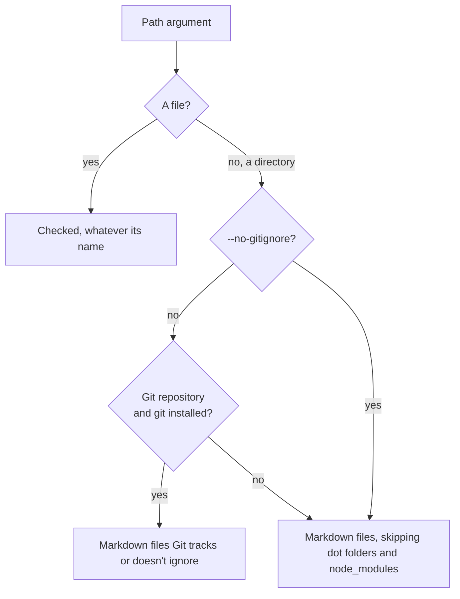

# md-links-checker

[](https://jsr.io/@simonneutert/md-links-checker)
[](https://github.com/simonneutert/md-links-checker/actions/workflows/ci.yml)

<p align="center">
  
</p>

For developers whose documentation lives in the repository, next to the code:
READMEs, `docs/` folders and changelogs, read on GitHub, GitLab or Bitbucket.
Run it before you push, or in CI, to catch links broken by a renamed file or
heading. Heading anchors follow GitHub's rules, which GitLab shares;
`--flavor bitbucket` switches to Bitbucket's. File links hold on any host.

Checks relative links in Markdown and MDX files: inline (`[text](./a.md)`),
images, reference definitions (`[ref]: ./a.md`), HTML (`<a href="./a.md">`) and,
in MDX, JSX (`<a href>`, `<Link to>`). A link fails when its target file doesn't
exist, or when its `#anchor` doesn't match a heading in the target Markdown file
(including `-1` suffixes for repeated headings) or an HTML `id` or `name` in it,
or when it is empty (`[text]()`). A reference without a definition
(`[text][nope]`) fails too.

Files are parsed as CommonMark with GitHub's extensions
([micromark](https://github.com/micromark/micromark)), so code, comments, front
matter and HTML blocks are skipped the way GitHub skips them. See
[Limitations](#limitations) for what is not covered.

**External links** are not checked: the ones with a scheme (`https:`, `mailto:`,
`jsr:`, …) or to another host (`//x.test`). `--external` lists them so you can
review them, but fetching them is out of scope: pipe the list into a tool of
your choice.

## Usage

Basic usage:

```sh
# Check the current directory
deno run -R --allow-run=git jsr:@simonneutert/md-links-checker

# `-r` to reload the checker from JSR and check the current directory
deno run -r -R --allow-run=git jsr:@simonneutert/md-links-checker
```

More specific examples with flags and paths:

```sh
# Check specific files and directories
deno run -R --allow-run=git jsr:@simonneutert/md-links-checker README.md docs

# Walk without Git: skips dot folders and node_modules instead of .gitignore
deno run -R jsr:@simonneutert/md-links-checker --no-gitignore docs

# Also list the external links, or print the result as JSON
deno run -R --allow-run=git jsr:@simonneutert/md-links-checker --external docs
deno run -R --allow-run=git jsr:@simonneutert/md-links-checker --json docs

# Resolve links starting with `/` from a static site's build output
deno run -R --allow-run=git jsr:@simonneutert/md-links-checker --root dist posts

# Match Bitbucket's heading anchors (or docusaurus; github is the default)
deno run -R --allow-run=git jsr:@simonneutert/md-links-checker --flavor bitbucket

# Show all options
deno run jsr:@simonneutert/md-links-checker --help
```

Links starting with `/` resolve from the root of the Git repository you run the
checker in, or from the current directory outside Git or with `--no-gitignore`.
`--root <dir>` resolves them from `<dir>` instead.

Directories are walked for `.md`, `.mdx` and `.markdown` files. Inside a Git
repository, files Git ignores are skipped; outside one, dot folders and
`node_modules` are skipped. Files named on the command line are always checked.

Problems are printed to stderr as `file:line:column:`, which editors and
terminals can jump to, and the process exits with `1`:

```
docs/guide.md:3:5: ./setup.md#instal (missing anchor)
docs/guide.md:12:1: ../gone.md (missing file)
docs/guide.md:40:18: ./Setup.md (wrong case)
docs/guide.md:52:7: [the API][api] (undefined reference)
Checked 12 files
```

An unknown option or flavor, or a path that doesn't exist, exits with `2`.

`wrong case` is a link that only works because the file system ignores case, as
macOS does by default: `./Setup.md` finds `setup.md` on a Mac but breaks on
Linux and GitHub. On Linux, the same link is a `missing file`.

`empty link` is a link with no target: `[text]()`, `[text](<>)`, `[ref]: <>` or
`<a href="">`. GitHub renders it as a link to the page itself, so it looks fine,
but it is usually a placeholder someone forgot to fill in.

`undefined reference` is `[text][label]` or `[label][]` with no `[label]:`
definition in the file. GitHub renders it as plain text, brackets included.

`invalid MDX` is an `.mdx` file (or any file with `--flavor docusaurus`) the MDX
parser rejects, such as a stray `<` or `{`. Its links can't be read, and the
site build fails on it too.

`--external` also lists the external links on stdout, before the problems. It
only lists them, it does not check them:

```sh
deno run -R --allow-run=git jsr:@simonneutert/md-links-checker --external docs
```

`--json` prints the result to stdout as JSON instead, so you can pipe it:
`checked` files and `problems`, plus `external` links when combined with
`--external`. Each problem and link has its `file`, `line` and `column`:

```sh
# List the external links to check by hand
deno run -R --allow-run=git jsr:@simonneutert/md-links-checker --json --external docs \
  | jq -r '.external[].link' | sort -u
```

### Static sites

The same docs often end up on a site, too.

On a static site, `/images/x.png` or `/posts/2022/02/23/foo/` only exist in the
build output. Build first, then check the Markdown sources with `--root` set to
the build output. A link into an HTML page counts if the file or folder exists;
its `#anchor` is not checked.

[quickblog](https://github.com/simonneutert/deno-quickblog) builds into `dist/`,
and copies `public/` into it:

```sh
deno run -A jsr:@simonneutert/quickblog build
deno run -R --allow-run=git jsr:@simonneutert/md-links-checker --root dist posts
```

[Jekyll](https://jekyllrb.com) builds into `_site/`:

```sh
bundle exec jekyll build
deno run -R --allow-run=git jsr:@simonneutert/md-links-checker --root _site _posts
```

Jekyll links written with Liquid, like `` or
`{{ site.baseurl }}/x/`, are not understood. With a `baseurl` such as `/blog`,
build with `--baseurl ""` so `/x/` links match `_site/x/`.

### Docusaurus

[Docusaurus](https://docusaurus.io) checks links itself while building the site,
and broken links to `.md` files only warn by default. This checker needs no
build for links between files and their anchors:

```sh
deno run -R --allow-run=git jsr:@simonneutert/md-links-checker --flavor docusaurus docs blog
```

`--flavor docusaurus` reads every file as MDX, `.md` included, as Docusaurus
does by default. It understands front matter, `{/* … */}` and `<!-- … -->`
comments, JSX links (`<a href>`, `<Link to>`) and custom heading ids
(`## Setup {#install}`, `## Setup {/* #install */}`). A custom id replaces the
heading's anchor, as on the Docusaurus site. `<!-- … -->` comments are dropped
the way Docusaurus 3 drops them by default, so `## Setup <!-- #install -->` is
`#setup`.

Links to the site's URLs, like `/docs/intro`, only exist in the build output,
which Docusaurus writes to `build/`:

```sh
npm run build
deno run -R --allow-run=git jsr:@simonneutert/md-links-checker --flavor docusaurus --root build docs
```

Docusaurus resolves a file link starting with `/` (`/intro.md`) from the `docs/`
folder. Check those with `--root docs` in a separate run, as one `--root` can't
serve both kinds of link.

## As a library

```ts
import {
  checkLinks,
  externalLinks,
  markdownFiles,
} from "jsr:@simonneutert/md-links-checker";

const files = await Array.fromAsync(markdownFiles("docs"));
const problems = await checkLinks(files); // [{ file, line, column, link, reason }]
// `/` links resolve from the current directory, or from `root`; anchors
// follow `flavor`, "github" by default:
// await checkLinks(files, { root: "/path/to/repo", flavor: "bitbucket" });
const external = await externalLinks(files); // [{ file, line, column, link }]
```

## Development

```sh
deno task test         # run the tests, failing below 80% coverage
deno task dev          # run them in watch mode
deno publish --dry-run # check the package before publishing
```

## Limitations

- **External links** are listed with `--external`, never fetched.
- **Links starting with `/`** resolve from the Git repository you run the
  checker in, not the one the file is in, unless `--root` is given.
- **Raw HTML** is read with patterns: only `<a href="…">` with a quoted value is
  a link. ``, unquoted `href=./a.md` and entities such as `&amp;` in an
  `href` are not handled.
- **MDX**: JSX links are `<a href>` and `<Link to>` with a plain string value.
  `import` paths and `@site/` aliases are not checked, and a Docusaurus URL
  (`/docs/intro`) needs the build output as `--root`.
- **Bitbucket anchors** follow the rules the
  [bitbucket-slug](https://www.npmjs.com/package/bitbucket-slug) package found
  by trial; Bitbucket documents none. That repeated headings get `_1`, `_2`, …
  is a guess.
- **Undefined references** are only found in their full (`[text][label]`) and
  collapsed (`[label][]`) forms. `[label]` alone is too often plain text, and so
  is `[a][b]` right after a letter, digit or `]`, as in `m[0][1]`.

## Requirements

- [Deno](https://deno.com) 2. The dependencies (`@std/cli`, `@std/path`, and the
  micromark parser with its GFM, front matter and MDX extensions from npm) are
  fetched on the first run.
- Git is optional. Inside a Git repository, it decides which files to check and
  where links starting with `/` resolve from. Without Git, or with
  `--no-gitignore`, the checker walks directories itself.

Deno permissions:

| Flag              | Why                                                                      |
| ----------------- | ------------------------------------------------------------------------ |
| `-R`              | Read the Markdown files. Always needed.                                  |
| `--allow-run=git` | Run `git ls-files` and `git rev-parse`. Leave out with `--no-gitignore`. |

Without `--allow-run=git` (and without `--no-gitignore`), Deno asks for
permission in a terminal and fails in CI.

How the files to check are found:



## License

MIT
